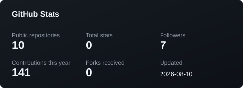
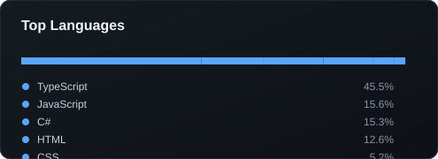

# Hey, I'm Ramy 👋

### Backend / Full-Stack JavaScript Engineer

I’m a Computer Engineering graduate focused on building **reliable backend systems, APIs, and real-time applications** with the MERN ecosystem.

I enjoy going beyond making things "work" — I’m interested in understanding **why systems are designed the way they are**, how they behave under failure and concurrency, and how to structure code that remains maintainable as the system grows.

---

## 🛠️ What I Work With

**Backend**

* Node.js
* Express.js
* Nest.js
* TypeScript
* REST APIs
* MongoDB
* JWT & OAuth
* Socket.IO / WebSockets
* Authentication & Authorization
* Multi-tenancy
* Background Jobs & Queues

**Frontend**

* React
* JavaScript / TypeScript
* TanStack Query
* HTML / CSS

**Engineering**

* N-Tier / Layered Architecture
* SOLID principles
* API design
* Database modeling
* Concurrency & consistency
* Caching
* Testing
* Load testing
* Git & GitHub
* Docker

---

## 🚀 Featured Project

### InTouch

A portfolio-grade **multi-tenant real-time communication platform** inspired by applications such as Slack and Discord.

**Tech:** TypeScript · Node.js · Express · MongoDB · Socket.IO · JWT · OAuth · React

The project focuses on backend engineering concepts beyond basic CRUD:

* Multi-tenant architecture
* Organization & membership authorization
* Role-based access control
* JWT access & refresh token authentication
* OAuth identity linking
* Real-time messaging
* Direct messaging
* Presence & typing indicators
* Read receipts & unread counts
* Pagination
* Transactional operations
* Service/repository separation
* API documentation with OpenAPI

[View the project →](https://github.com/RamyMohamed47/intouch)

---

## 📚 Currently Improving

I'm currently focusing on becoming a stronger backend engineer by going deeper into:

* TypeScript for large codebases
* Distributed systems fundamentals
* Database design & performance
* Concurrency and race conditions
* Caching strategies
* Queues and asynchronous processing
* Testing and observability
* System design
* Production deployment

---

## 🎯 Engineering Philosophy

> **Don't just make it work. Understand why it works.**

I try to approach engineering problems by thinking about:

**Correctness → Maintainability → Performance → Scalability**

I’m especially interested in the problems that appear after the happy path — concurrent requests, authorization boundaries, partial failures, stale state, data consistency, and systems that need to evolve without becoming impossible to maintain.

---

## 📊 GitHub

---

## 🤝 Let's Connect
* 💼 Open to **Backend / Full-Stack JavaScript opportunities**
* 📍 Egypt
* 💻 GitHub: [@RamyMohamed47](https://github.com/RamyMohamed47)
* 💼 LinkedIn: [Ramy Mohamed](https://linkedin.com/in/ramy-mohamed-b84920217/)
* ✉️ Email : mohamedramy228@ymail.com
* 🎨 Portfolio: (TBD)

---

### Thanks for stopping by 👋

<!--
**RamyMohamed47/RamyMohamed47** is a ✨ _special_ ✨ repository because its `README.md` (this file) appears on your GitHub profile.

Here are some ideas to get you started:

- 🔭 I’m currently working on ...
- 🌱 I’m currently learning ...
- 👯 I’m looking to collaborate on ...
- 🤔 I’m looking for help with ...
- 💬 Ask me about ...
- 📫 How to reach me: ...
- 😄 Pronouns: ...
- ⚡ Fun fact: ...
-->
